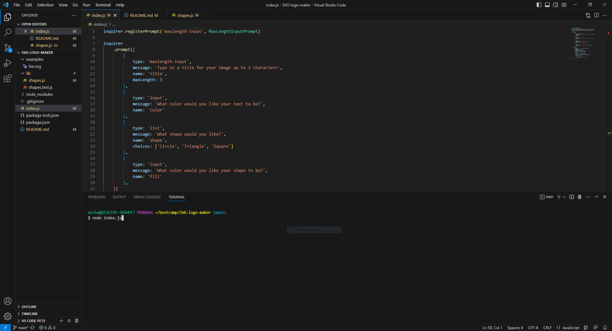
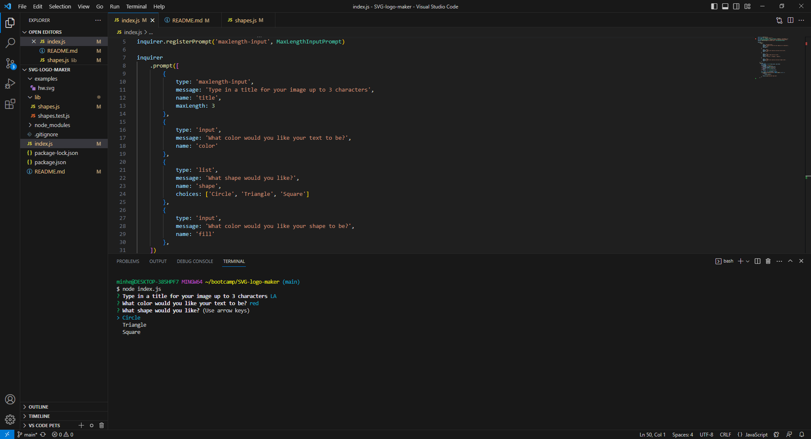
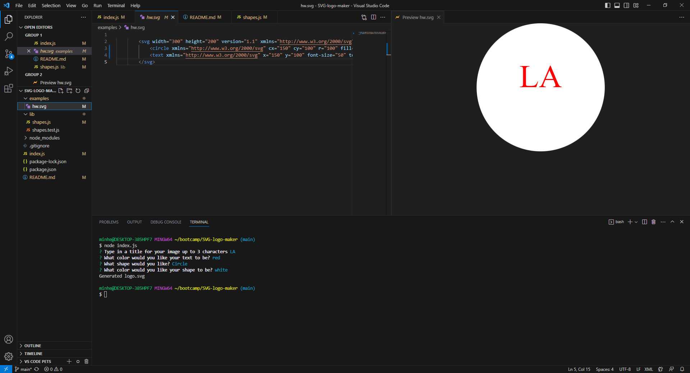
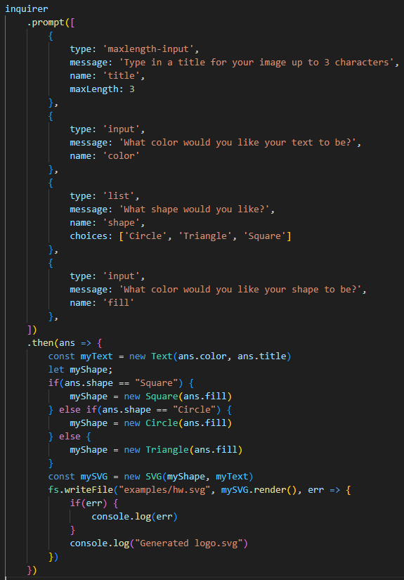
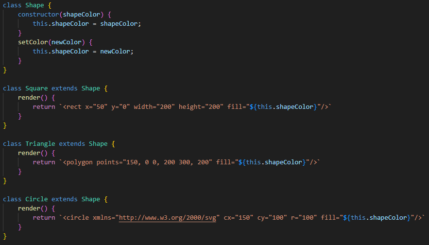
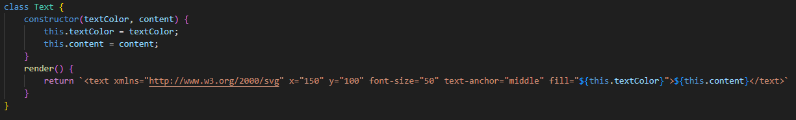
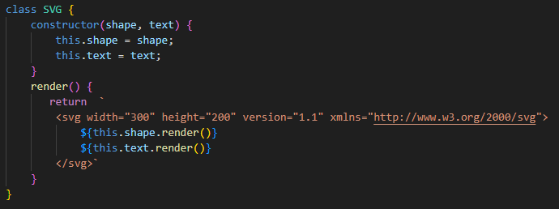

# SVG-logo-maker

## Description

The SVG logo maker creates a logo based on the user's input of a shape, fill color, text, and text color. It solves the problem of having to create logos in an editor and generates it in less than a minute. I learned to use SVG, node.js, and classes with elemenets and methods.

## Table of Contents 

- [Installation](#installation)
- [Usage](#usage)
- [Credits](#credits)

## Installation

- node.js is needed for the program to run (https://nodejs.org/en)
- In order to view the SVG file, you also need the SVG preview extension on VS code.

## Usage

First, type in "node index.js" to get prompted with the questions from the inquirer npm

The shape question is presented as a list so that the user will select one option.

This is the resulting image that was generated by the user input in the terminal.

This code prompts the user with the 4 questions and then uses those answers to generate a shape, using the corresponding classes. Then, fs is used to write a file under the examples folder. When all is complete, "Generated logo.svg" is printed in the command line.

The classes Square, Triangle, and Circle are, in a way, subclasses of the class Shape. They render and return a line of code that will be put into the SVG class.

The text class and render method works in a similar way to the shape that the text tag is returned into the SVG class. 

The SVG class is used to create a variable called newSVG that uses the render method to take that data to write in the file, hw.svg.

## Credits

- Tutor Joem Casusi

### npms
- inquirer: https://www.npmjs.com/package/inquirer#prompt
- max inquirer: https://www.npmjs.com/package/inquirer-maxlength-input-prompt
- fs